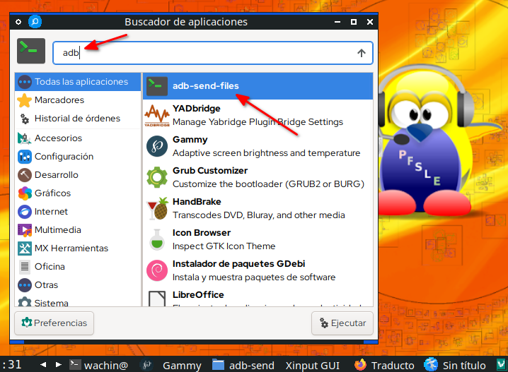
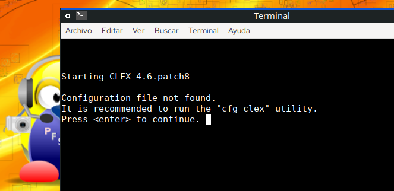
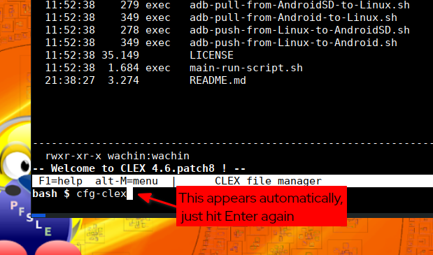
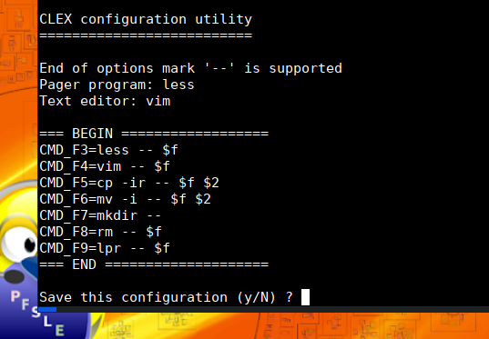
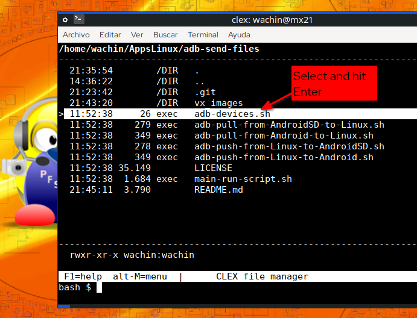
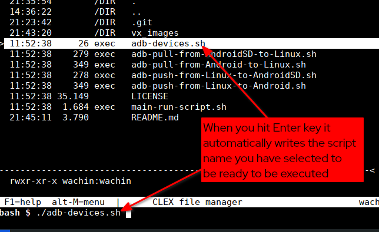
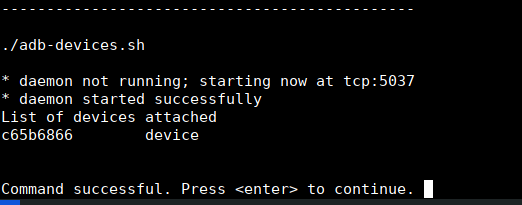

# adb-send-files
Copy/Transfer files from Android to Linux PC and from Linux PC to Android with adb, using script running from a Linux terminal inside Clex Terminal File Manager

# Tested in

- [MX Linux 21](https://sourceforge.net/projects/mx-linux/files/Final/) x386 and SAMSUNG GALAXY J5 Android 6.0.1

# Requirements
Is neccesary Android 6 and above

On Linux install dependencies:

    sudo apt install git perl clex adb gnome-terminal bash

# Enabling USB Debugging on the Android Device
In your Android mobile you need enable USB Debugging like this:

https://www.embarcadero.com/starthere/xe5/mobdevsetup/android/en/enabling_usb_debugging_on_an_android_device.html 

Note: To each Android phone is diferent, yo need to search in Google to match your phone

# Download and install the code
In a terminal set this:

    mkdir -p AppsLinux
    cd AppsLinux
    git clone https://github.com/wachin/adb-send-files
    cd adb-send-files
    ./set_launcher_path.sh
    cp adb-send-files.desktop $HOME/.local/share/applications/
    mv adb-send-files.desktop set_launcher_path.sh vx_images/ && cd   
    echo "God Bless You"    

This create and install all neccesary files under a Folder called:

AppLinux

please do not delete it

    
# Setup to Internal Memory
Now you need to create in your Android device in your HOME a folder called:

**adb-android**

And you need to create in your Linux Operative System in your HOME a folder called:

**adb-linux**

# Setup to External micro SD Memory
This is only if you have a micro SD Card extra in your phone, You need create in your Android SD extra storage device a folder called:

**adb-SD-android**

and in your Linux OS in your HOME the same above folder called:

**adb-linux**

# Connect your Android mobile to your Linux PC with the USB cable
This step is totally neccesary, make sure the cable is good

# Now search in your Apps to "adb-send-files"
Search in your Apps:

open it. The firs time when you open it appear clex with a message:

just hit Enter again:

something very important appears, a little tutorial:

CLEX configuration utility
==========================

End of options mark '--' is supported
Pager program: less
Text editor: vim

=== BEGIN ==================
CMD_F3=less -- $f
CMD_F4=vim -- $f
CMD_F5=cp -ir -- $f $2
CMD_F6=mv -i -- $f $2
CMD_F7=mkdir -- 
CMD_F8=rm -- $f
CMD_F9=lpr -- $f
=== END ====================

I don't use those instructions, but maybe they could be useful to you, for one thing, there they are

then in your keyboard write:

y

and hit Enter, and appear a message that said:

> Configuration saved
> Please restart CLEX
> 
> Command successful. Press <enter> to continue. 

These steps only need to be done once.

Now the first you have to do is clic on adb-devices.sh

When you hit Enter key it automatically writes the script name you have selected to be ready to be executed:

hit Enter again

then you see that clex run the script to start:

adb devices

command. Then hit Enter again

Now yo need to see what do you want to do

## To send files from Linux to Android
 Clic in:
 
adb-push-from-Linux-to-Android.sh

## To send files from  Android to Linux
Clic in:

adb-pull-from-Android-to-Linux.sh

## To send files from Linux to Android micro SD Card
 Clic in:
 
adb-push-from-Linux-to-AndroidSD.sh 

## To send files from  Android micro SD Card to Linux
Clic in:

adb-pull-from-AndroidSD-to-Linux.sh

# Manually open clex file manager to execute scripts (optional)
Perhaps you want to do this. Open your Linux File Manager and navigate to this folder:

**adb-send-files**

If you use Thunar File Manger, right clic on:

    main-run-script.sh

and open it with bash, if bash not appear you need to write that in the options:

Right clic in the script /  Properties / Open with / othe application / Use personalized order / 

in that write:

bash

Apply

The Linux File manager need to be configured to open scripts .sh 

 In other Linux File Manager like Dolphin you hit ENTER and propt if you want to execute, the same is for Caja, Nemo File Manager, and search how to do with others

# Clex tutorials
Perhaps you need:

Help topics
[http://www.clex.sk/help/MAIN.html](http://www.clex.sk/help/MAIN.html)

clex: Simplified file management | Inconsolation
[https://inconsolation.wordpress.com/2013/07/20/clex-simplified-file-management/
](https://inconsolation.wordpress.com/2013/07/20/clex-simplified-file-management/)

God Bless

This is and idea from:

**Copiar carpeta/archivos desde Android a Linux & Linux a Android con adb (por cable USB)**  
https://facilitarelsoftwarelibre.blogspot.com/2020/05/como-copiar-carpetaarchivo-desde.html

